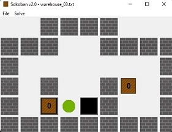

*An AI assignment by Nina and Nathan*

We implement a provided `search.py` module to solve the Sokoban puzzle and its weighted variation. `mySokobanSolver.py` shows our interface to the search module detailing initial state, static puzzle features, legal actions for the agent, how state updates, a path cost function and an admissible heuristic function.

Our code can be found in `mySokobanSolver.py` and `test_scripts.py`. All other files are authored by *f.maire at qut.edu.au* or as noted in file header comments.
